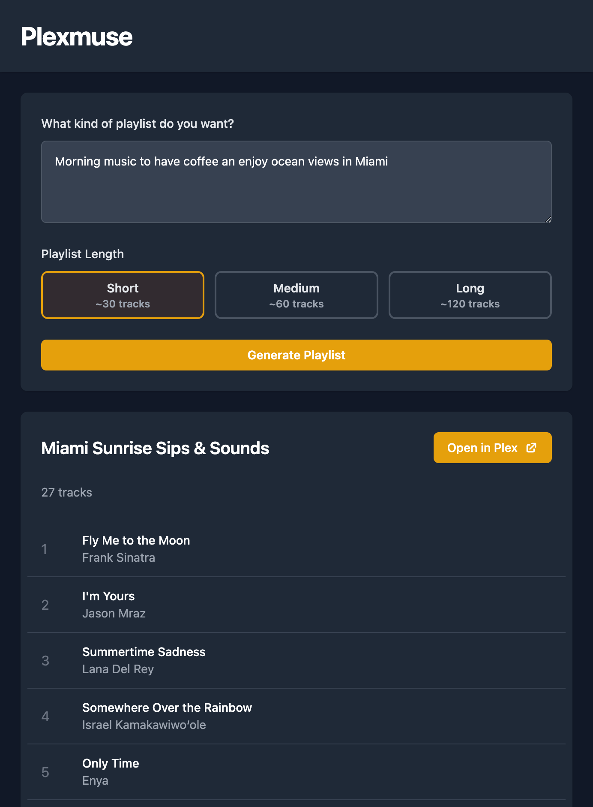

# Plexmuse 🎶🤖

Welcome to **Plexmuse**! This project leverages the power of AI to generate personalized playlists from your Plex music library. Whether you're looking for new music recommendations or creating the perfect playlist for any occasion, this API has got you covered.

## Features ✨

- **AI-Powered Recommendations**: Generate playlists using advanced language models like GPT-4 and Claude.
- **Seamless Plex Integration**: Fetch and manage your music library directly from Plex.
- **Customizable Playlists**: Tailor your playlists with specific prompts and models.

## Getting Started 🚀

### Prerequisites

- Python 3
- Plex Media Server with a Music library
- OpenAI API Key (for GPT-4)
- Anthropic API Key (optional, for Claude)

### Installation

1. **Clone the repository**:
    ```sh
    git clone git@github.com:LubergAlexander/plexmuse.git
    cd plexmuse
    ```

2. **Setup**:
    ```sh
    make all
    ```

3. **Set up environment variables**:
    Create a [.env](http://_vscodecontentref_/0) file in the root directory and add your API keys:
    ```env
    OPENAI_API_KEY=your_openai_key
    ANTHROPIC_API_KEY=your_anthropic_key
    PLEX_BASE_URL=your_plex_base_url
    PLEX_TOKEN=your_plex_token
    ```

### Running the Application

You can run the application using the Makefile or directly with Docker.

#### Using the Makefile

1. **Set up and run the application**:
    ```sh
    make run
    ```
2. **Start**:
    ```sh
    make start
    ```

#### Using Docker

1. **Build the Docker image**:
    ```sh
    docker compose build
    ```

2. **Start the Docker container**:
    ```sh
    docker compose up
    ```

### Accessing the API Documentation

Open your browser and navigate to `http://127.0.0.1:8000/docs` to explore the API endpoints.

### User Interface

Access the user interface at the root route `/`. This UI allows you to interact with the API, select playlist length, and is mobile-friendly.


## Usage 📖

### Create Playlist Recommendations

Send a POST request to `/recommendations` with the following JSON body:

```json
{
    "prompt": "Chill vibes for a rainy day",
    "model": "claude",
    "min_tracks": 10,
    "max_tracks": 20
}
